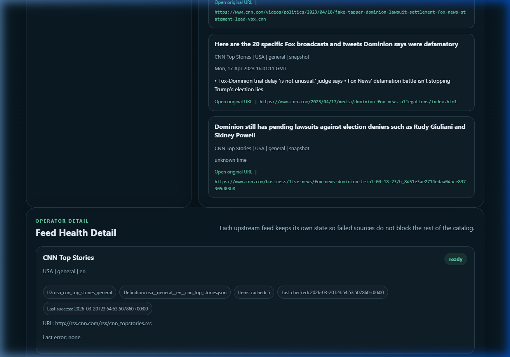

# Open World News MCP: Global Intelligence Interface

> **One event, different national narratives.**  
> Decode how the world's media frames global crises, energy, and diplomacy.

| [🚀 Live Demo](http://35.202.58.51:8766/sse) | [🏗️ Architecture](docs/architecture.md) | [🛠️ Tools](docs/tools.md) | [🔍 Privacy Scope](docs/privacy_scope.md) |
| :--- | :--- | :--- | :--- |

---

## 🌎 What is Open World News MCP?
It is a **Country-Aware Intelligence Layer** for AI agents. In a world of geopolitical shifts, the "facts" are only the surface. The real intelligence lies in the **narratives**—how the same event is told by local media across the US, UK, Middle East, and Asia.

## 🛠️ How to Try (Quick Setup)
1. **Open your MCP client** (e.g., Claude Desktop, ASDK Studio).
2. **Add the SSE Endpoint**: `http://35.202.58.51:8766/sse`
3. **Run a prompt**: *"What are the local headlines in Saudi Arabia regarding energy security?"*

---

## 🔥 Why Narrative Comparison Matters
During global conflicts, information is prioritized differently across regions. This tool reveals those framing shifts side-by-side.

### 🇺🇸 USA: Strategic Deterrence
Focuses on security alliances, military deterrence, and global economic pressure.  
[USA Example Data](docs/examples/usa_headlines_sample.json)

### 🇬🇧 UNITED KINGDOM: Legal & Humanitarian
Emphasizes international law, humanitarian assessmemts, and domestic energy impact.  
[UK Example Data](docs/examples/uk_headlines_sample.json)

### 🇸🇦 SAUDI ARABIA: Regional Stability
Prioritizes regional readiness, energy leadership, and de-escalation posture.  
[Saudi Example Data](docs/examples/saudi_headlines_sample.json)

---

## 📸 Dashboard Preview

> *Technical Preview: The Operator Interface monitors feed health and tool parity.*

---

## ✨ Key Features
- **Perspective Detection**: Not just *what* happened, but *how* it's reported.
- **Deep-Reading Engine**: Extracts the main article body for cleaner AI summarization and analysis.
- **Fast snapshots**: Immediate access to the latest global narrative snapshots.

## 📁 Repository Showcase Scope
This repository demonstrates the **Project Architecture, Model-Context Interface, and UI Dashboard**. 

> [!IMPORTANT]
> To protect proprietary operational logic (ingestion engine, fallback heuristics), the core background processing logic is private. The Live Demo provides the actual intelligence stream.

## 📝 License
Licensed under the **General & Non-Commercial Use License**. Commercial use requires prior authorization.

---
© 2026 Open World News MCP. Tracking the world's shifting narratives.
