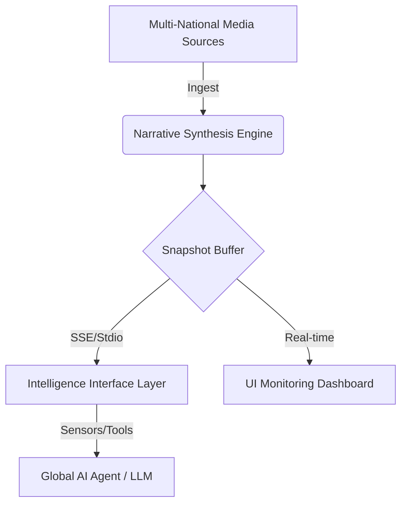

# Architecture Overview: Global Intelligence Interface

## 1. Design Philosophy
The primary goal is **"Multi-National Perspective Analysis"**. Modern AI agents require more than just data; they need to understand **framing**. This architecture is built as a specialized sensor layer for AI to detect how different countries describe war, diplomacy, markets, and regional crises.

## 2. High-Level Workflow

## 3. Data Flow Layers
### Layer 1: Intelligent Ingestion & Normalization
- Aggregates feeds from 10+ geopolitical regions.
- Handles publisher-specific formats and character encodings.
- Normalizes "Raw Data" into "Intelligence Objects."

### Layer 2: Global Narrative Snapshot (In-memory)
- Maintains a low-latency "Now" view of world event framing.
- Decoupled from the engine for maximum uptime and stability.

### Layer 3: Model Context Protocol (MCP) Interface
- Exposes standardized tools for LLMs.
- Reduces "Fact Hallucination" by providing direct source comparison.

### Layer 4: Intelligence Dashboard
- A high-level interface for overseeing global narrative health and tool parity.

## 4. Competitive Advantage
- **Perspective Detection**: Not just *what* happened, but *how* it's reported.
- **AI-Native Interface**: Zero-clutter JSON specifically for model context windows.
- **Reliable Connectivity**: SSE streaming for robust remote analytics.

---
*For sensor specifications, see [tools.md](tools.md).*
