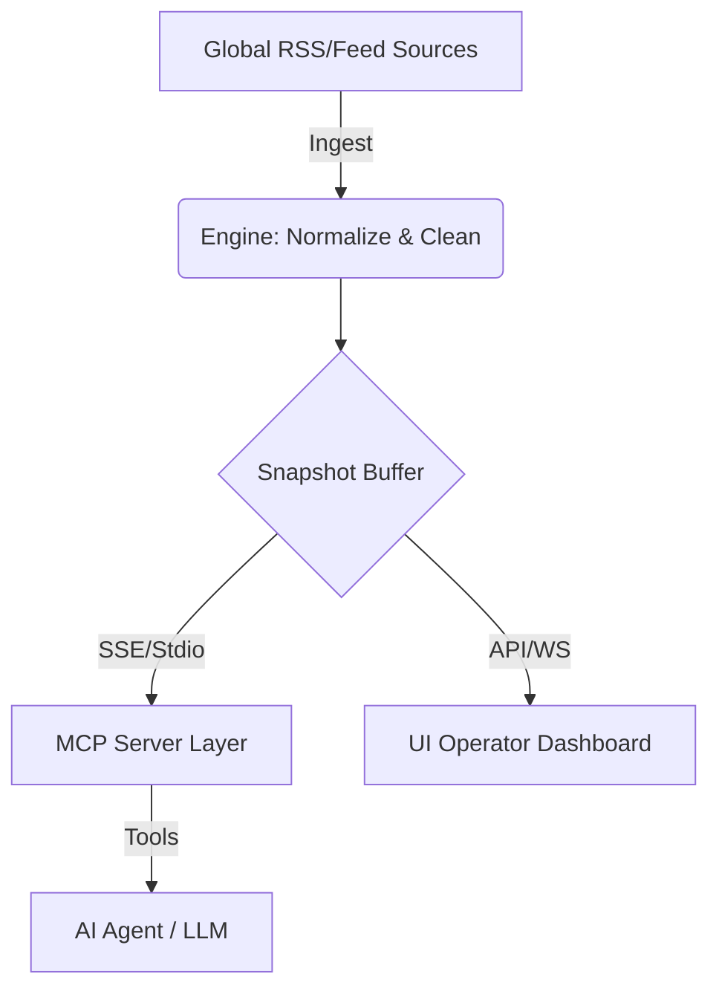

# Architecture Overview: Open World News MCP

## 1. Design Philosophy
The primary goal is to provide **"Contextual Awareness"**. Standard news APIs often lack the ability to contrast how different nations report on the same global event. This MCP bridges that gap by providing direct access to national narratives.

## 2. High-Level Workflow

## 3. Data Flow Layers
### Layer 1: Ingestion & Normalization
- Aggregates feeds from 10+ countries.
- Handles publisher-specific formats and character encodings.
- Filters out non-news metadata.

### Layer 2: Real-time Catalog (In-memory)
- Maintains a low-latency "Now" view of world news.
- Performs background refreshes to ensure data freshness (~12h cycles).

### Layer 3: MCP Interface
- Exposes a consistent set of tools to AI models.
- Provides "Article Deep-Reading" on demand to reduce hallucination.

### Layer 4: Monitoring
- A dedicated web interface for overseeing feed health and tool performance.

## 4. Why This Architecture?
- **Speed**: In-memory catalogs allow users to get headlines in milliseconds.
- **Reliability**: Decoupling the feed engine from the MCP server ensures that external site failures don't crash the AI response.
- **Portability**: Supports both local (Stdio) and remote (HTTP/SSE) connection modes.

---
*For more information on the tools, see [tools.md](tools.md).*
